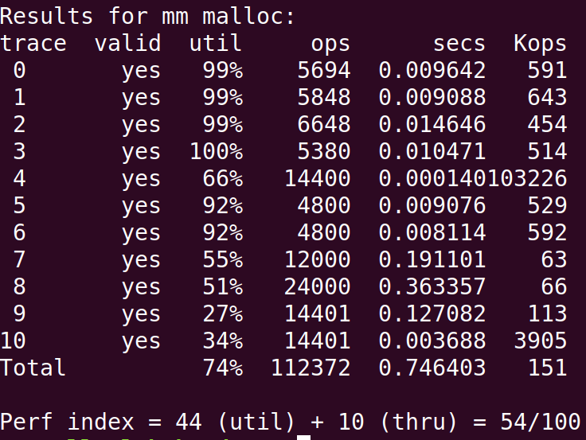
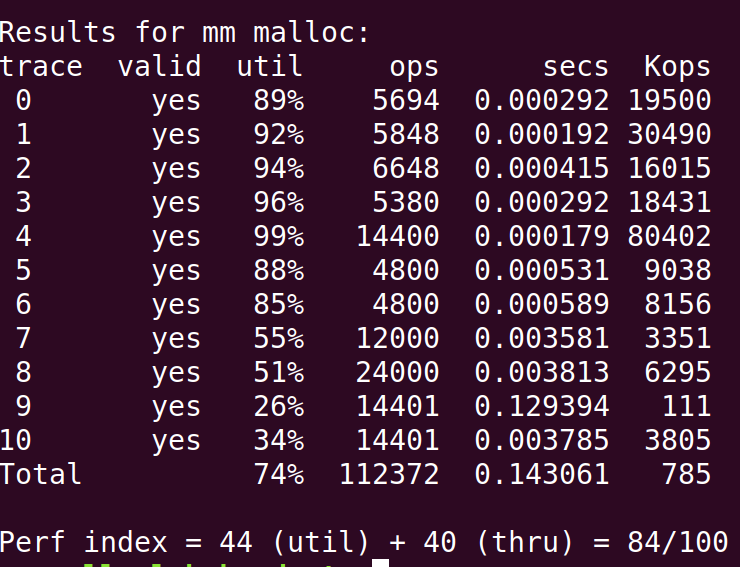

# malloclab
本次lab需要我们事先一个显示的动态内存分配器，要实现4个函数，malloc,free,realloc以及calloc函数。  

ps:之前几个实验都是在wsl上跑的，除了需要更改32位以外，别的倒没什么问题，但是这次实验的评分是和时间相关的，我发现wsl里跑的太慢了。。。所以改成笔记本Ubuntu跑了。

存储器需要两个方面技术：空闲块组织方式，以及查找空闲块的方法。  
空闲块组织方式有：  
* 隐式空闲链表
* 显式空闲链表
* 分离空闲链表  

查找空闲块的方式有：  
* 首次适配
* 最佳适配
* 下一次适配

在memlib.c模拟了内存系统，提供了如下几个方法：
* `void *mem_sbrk(int incr)`：让堆扩展 incr 个字节，并返回新分配的地址的头指针
* `void *mem_heap_lo(void)`：返回指向堆的第一个字节的指针
* `void *mem_heap_hi(void)`：返回指向堆的最后一个字节的指针
* `size_t mem_heapsize(void)`：返回当前的堆大小
* `size_t mem_pagesize(void)`：返回系统的 page size

## 隐式空闲链表+首次适配+原始realloc
我们首先选用最简单的隐式空闲链表+首次适配+原始realloc方式。

首先采用csapp书中最简单的方式，采用隐式空闲链表组织空闲块，并且在头部和尾部添加了序言块和结尾块，方便添加和释放块。

在空闲块适配上，我们同样才用了最简单的首次适配策略，由头到尾遍历的第一个符合大小的空闲块会被采用。这种方式显然不是最佳，会在头部形成大量碎片。

realloc方式，我们采用的是直接搜索全部空闲块的方式进行，这点做一些小改进。(如果前后有空闲块，可以进行合并，不需要再次请求)

这种方式的实验结果如下：  

可以看到，因为选取的方案特别简单，所以得分也特别低。。。代码可以在[mem-1](./malloclab-handout/mm-1.c)

## 显示空闲链表+首次适配+原始realloc
对于隐式空闲链表，要找到空闲链表，是O(l)时间，其中l为所有块的长度。如果我们将其改进为显示空闲链表，也就是再添加一个双向链表组合空闲链表队列，那么只需要O(e)时间，其中e为空闲块长度。

具体来说，我们采用的显示空闲链表策略为LIFO，也就是新释放的空闲块会被存放到队列头，获取空闲块的时候从队列头开始搜索。

经过这种改善，我们的实验结果如下：  

可以看到分数比显示的要提高了很多，这和我们理论分析也是一致的。代码可以在[mem-2](./malloclab-handout/mm-2.c)

## 分离空闲
